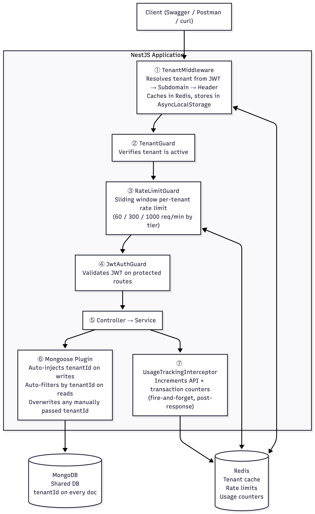
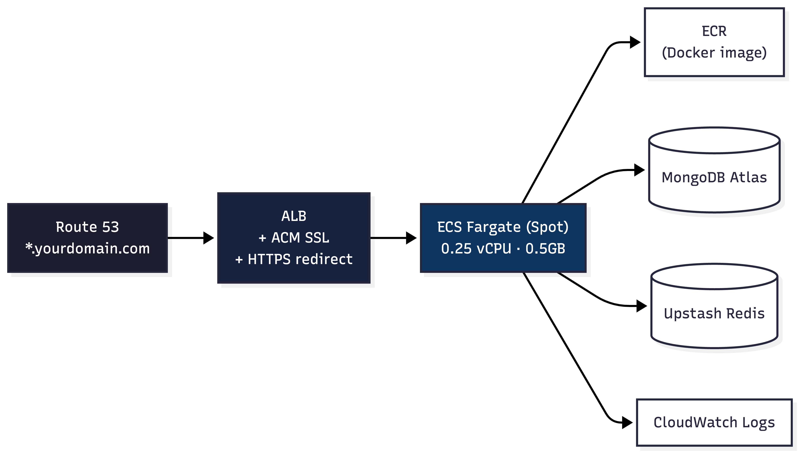

# Multi-Tenant Payment Platform

Multi-tenant payment platform with automatic data isolation, per-tenant rate limiting, and usage tracking. Built with NestJS 10, MongoDB (Mongoose), and Redis (ioredis).

---

## Assumptions

- **Backend-only submission.** I chose to focus on backend architecture and cloud deployment rather than building a frontend. All APIs are fully testable via **Swagger UI** (`/docs`) or **curl/Postman**.
- Shared MongoDB database with row-level tenant isolation (single DB, `tenantId` on every document). Designed to scale to database-per-tenant for Enterprise clients without architectural changes.
- Three tenant tiers — Starter, Professional, Enterprise — with different rate limits, transaction caps, and feature access.

**Live Demo:** [https://multi-tenant-payment-platform-production.up.railway.app](https://multi-tenant-payment-platform-production.up.railway.app)
Swagger UI at [`/docs`](https://multi-tenant-payment-platform-production.up.railway.app/docs). The AWS deployment architecture (ECS Fargate + ALB) is detailed below — deployed to Railway for simplicity and to keep billing minimal.

**Video walkthrough:** [Loom Video](https://www.loom.com/share/cc5e2f5145734e8cb4c173d8635d5104)

---

## Quick Start

```bash
# Start MongoDB, Redis, and the API
docker compose up --build -d

# Seed test data (tenants, users, payments — prints JWT tokens)
docker compose run --rm seed
```

API: **http://localhost:3000** · Swagger: **http://localhost:3000/docs**

The seed command prints JWT tokens and ready-to-use curl commands.

```bash
# Stop containers (keeps data)
docker compose down

# Stop and delete all data
docker compose down -v
```

<details>
<summary>Without Docker</summary>

```bash
npm install
cp .env.example .env   # Add your MongoDB URI and Redis URL
npm run seed
npm run start:dev
```
</details>

---

## Architecture



**Task A — Tenant Resolution:** Middleware resolves tenant from JWT claims (most trusted) → subdomain → `X-Tenant-ID` header → custom domain lookup. Cached in Redis.

**Task B — Data Isolation:** Mongoose plugin hooks into every `find`, `save`, `update`, `delete`, and `aggregate` operation. Developers never manually filter by `tenantId` — and they *cannot* bypass it. Even `find({ tenantId: 'other-tenant' })` gets overwritten.

**Task C — Rate Limiting & Usage:** Sliding window counter via `rate-limiter-flexible` (Redis-backed). Monthly API call and transaction counters in Redis with TTL-based auto-cleanup.

---

## AWS Deployment

Deployable to **AWS ECS Fargate** behind an Application Load Balancer using [SST v3](https://sst.dev). Supports wildcard subdomain routing (`*.yourdomain.com`) for tenant resolution.



SST auto-provisions: VPC, Security Groups, ECR, ECS Cluster, Task Definition, Fargate Service, ALB, Target Group, IAM Roles, CloudWatch Logs. All defined in `sst.config.ts`.

```bash
npx sst deploy --stage prod    # Deploy everything
npx sst remove --stage prod    # Tear down (stop billing)
```

---

## API Reference

### Admin (no tenant scoping)

| Method | Endpoint | Description |
|--------|----------|-------------|
| `GET` | `/api/health` | Health check |
| `POST` | `/api/admin/tenants` | Create tenant |
| `GET` | `/api/admin/tenants` | List tenants |

### Tenant-Scoped (requires `X-Tenant-ID` header or subdomain or JWT)

| Method | Endpoint | Auth | Description |
|--------|----------|------|-------------|
| `GET` | `/api/tenant/config` | — | Tenant config (white-label, tier) |
| `POST` | `/api/auth/register` | — | Register user |
| `POST` | `/api/auth/login` | — | Login → JWT with tenantId |
| `POST` | `/api/payments` | JWT | Create payment (checks txn limit) |
| `GET` | `/api/payments` | JWT | List payments (paginated) |
| `GET` | `/api/payments/:id` | JWT | Get payment (404 if cross-tenant) |
| `GET` | `/api/usage` | JWT | Monthly usage stats |

Rate limit headers on every response: `X-RateLimit-Limit`, `X-RateLimit-Remaining`, `X-RateLimit-Reset`.

---

## Demo Flow

### Seeded test data

| Tenant | Tier | Email | Password | Rate Limit | Txn Limit |
|--------|------|-------|----------|------------|-----------|
| HDFC Bank | Starter | `admin@hdfc.com` | `password123` | 60/min | 1,000/mo |
| ICICI Bank | Professional | `admin@icici.com` | `password123` | 300/min | 50,000/mo |
| SBI | Enterprise | `admin@sbi.com` | `password123` | 1,000/min | Unlimited |

### 1. Login

```bash
curl -X POST http://localhost:3000/api/auth/login \
  -H "Content-Type: application/json" \
  -H "X-Tenant-ID: hdfc" \
  -d '{"email": "admin@hdfc.com", "password": "password123"}'
# Save the access_token as HDFC_TOKEN
```

### 2. Create a payment

```bash
curl -X POST http://localhost:3000/api/payments \
  -H "Content-Type: application/json" \
  -H "Authorization: Bearer $HDFC_TOKEN" \
  -H "X-Tenant-ID: hdfc" \
  -d '{"amount":50000,"currency":"INR","senderName":"Rahul","senderAccount":"ACC001","receiverName":"Priya","receiverAccount":"ACC002"}'
```

### 3. Verify data isolation

```bash
# HDFC token sees only HDFC payments
curl http://localhost:3000/api/payments -H "Authorization: Bearer $HDFC_TOKEN" -H "X-Tenant-ID: hdfc"

# ICICI token sees only ICICI payments — completely different data
curl http://localhost:3000/api/payments -H "Authorization: Bearer $ICICI_TOKEN" -H "X-Tenant-ID: icici"
```

### 4. Check usage

```bash
curl http://localhost:3000/api/usage -H "Authorization: Bearer $HDFC_TOKEN" -H "X-Tenant-ID: hdfc"
```

### 5. Hit the rate limit

```bash
# HDFC = starter tier (60 req/min). Fire 65 requests — last few return 429.
for i in $(seq 1 65); do
  curl -s -o /dev/null -w "$i: %{http_code}\n" \
    http://localhost:3000/api/payments -H "Authorization: Bearer $HDFC_TOKEN" -H "X-Tenant-ID: hdfc"
done
```

---

## Design Decisions

### AsyncLocalStorage over NestJS Scope.REQUEST

`Scope.REQUEST` forces every provider in the DI chain to become request-scoped — kills singleton caching and degrades performance. AsyncLocalStorage has zero DI impact, works inside Mongoose plugins (which can't be request-scoped), and is Node.js-native with built-in async context isolation.

### Shared Database with Row-Level Isolation

Single MongoDB database, `tenantId` on every document, enforced by a Mongoose plugin at the schema level. 90%+ of multi-tenant SaaS uses this pattern. Simpler to index, back up, and maintain. Migration to database-per-tenant for Enterprise clients requires only a connection strategy swap — the plugin and service layer stay identical.

### Sliding Window Rate Limiting

Fixed window has a boundary burst problem — a client can double their rate by timing requests at the window boundary. Unacceptable for a financial API. Sliding window (via `rate-limiter-flexible`) uses a weighted average across two consecutive windows. Atomic Redis operations prevent race conditions.

### Mongoose Plugin for Data Isolation

The plugin hooks into `pre('validate')`, `pre('find')`, `pre('updateOne')`, `pre('aggregate')`, etc. It auto-injects `tenantId` on creates and auto-filters on reads. Even if a developer writes `find({ tenantId: 'other' })`, the plugin overwrites it. Cross-tenant access is structurally impossible at the database layer.

---

## Scaling

**1,000+ tenants — no architectural changes needed:**
- All queries use compound indexes with `tenantId` as the first field. MongoDB only scans one tenant's data per query.
- Redis handles millions of keys. 1,000 tenants = ~3,000 keys for rate limits + usage.
- Tenant metadata cached in Redis (5min TTL). DB lookups only on cache miss.
- AsyncLocalStorage is zero-overhead — no per-request provider instantiation.

**When a tenant outgrows the shared database:**
1. Index optimization (already done — compound indexes with tenantId prefix).
2. Read replica routing for heavy-read tenants.
3. Migrate to dedicated database — create a `TenantDatabaseStrategy` interface. Shared tenants use the default connection; Enterprise tenants get their own. The Mongoose plugin and service layer stay identical — only the connection changes.

**Per-tenant rate limits already prevent noisy neighbor issues at the API layer.** For infrastructure-level isolation, route large tenants to dedicated ECS tasks via ALB rules.

---

## What I'd Add With More Time

- **BullMQ job queue** — async payment processing (pending → processing → completed)
- **Webhook system** — notify tenants on payment status changes
- **Comprehensive test suite** (Vitest) — unit tests for the Mongoose plugin, integration tests for the full request lifecycle
- **Database-per-tenant strategy** — hybrid approach where Enterprise tenants get dedicated databases while others share. Connection routing via `TenantDatabaseStrategy` interface.
